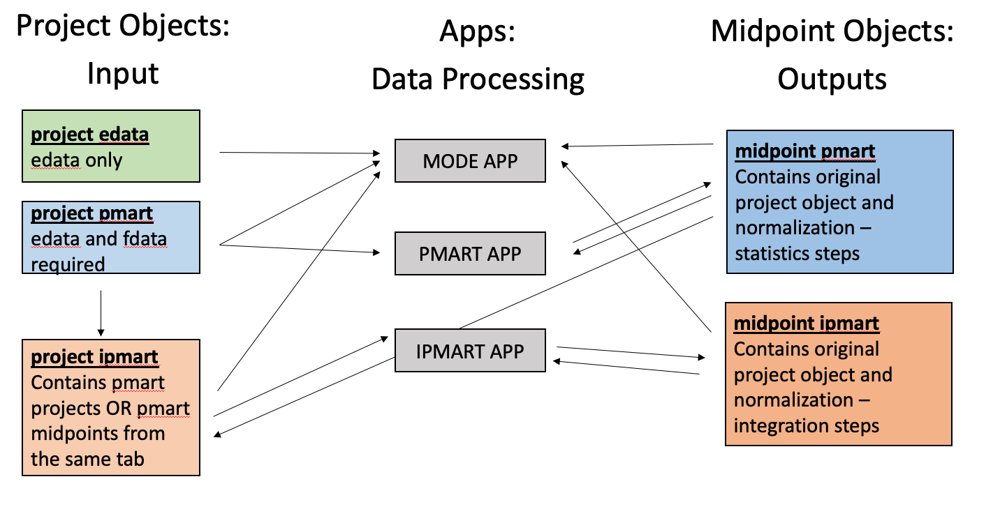

```{r setup, include=FALSE}
library(mapDataAccess); library(data.tree); library(pmartR)
knitr::opts_chunk$set(echo = FALSE, warning = FALSE, message = FALSE)
```

## Description

This markdown is to help users of mapDataAccess understand the project and midpoint
objects as well as their constructor and tagging functions. 

```{r}

```

**Projects:** These are unprocessed, raw objects that were designed so that only 
one unique universal identifier (UUID) would need to be passed to open an app with data.

* **project_edata:** The simplest project object requires only an e_data file. Designed specifically for MODE only. 

* **project_pmart:** Requires an e_data and f_data file. Can be opened by pmart or MODE.

* **project_ipmart:** A complicated project object that must contain 2-5 objects of the the following classes: lipidomics (max 2), metabolomics (max 2: max 1 GC/LC-MS, max 1 NMR), and proteomics (peptide or protein, max 1). All of the objects within the project_ipmart object must be either project_pmart or midpoint_pmart exported from the same tab. Can be opened by ipmart or MODE.

**Midpoints:** These are pmartR partially or completely processed data objects. 

* **midpoint_pmart:** An object exported by pmart. Contains both the original project objects and the processed data. Data exported from an application can be opened in the subsequent tab. The order of possible tabs to export a midpoint from are Normalization, Peptide Statistics, Protein Rollup, and Statistics. A midpoint_pmart can be opened again in pmart or incorporated with other pmart_midpoints from the same tab into a project_ipmart object. Can be opened by pmart or MODE. 

* **midpoint_ipmart:** An object exported by ipmart. Contains 2-5 datasets processed through the Normalization, Statistics, and Integration tabs. Can be opened by ipmart or MODE.

## project edata

```{r}
edataExample <- project_edata(projectname = "LipidToMode",
             datatype = "Lipidomics-Positive",
             edata = pmartRdata::lipid_edata,
             edata_filename = "lip_edata") 
class(edataExample) <- "list"
edataExample$Project$DataType <- edataExample$Project$DataType %>% as.list()
edataExample$Project$Name <- edataExample$Project$Name %>% as.list()
edataExample$Data$e_data_filename <- edataExample$Data$e_data_filename %>% as.list()
edataExample %>% data.tree::as.Node(nodeName = "project edata") %>% plot()
```

**Components:**

* *Project:* A label indicating project components

    + *Name:* The name of the project. Extra spaces and characters are removed. 

    + *DataType:* One of the acceptable data types. Current examples are: Peptide-level Label Free, Peptide-level Isobaric, Protein-level Label Free, Protein-level Isobaric, Lipidomics-Negative, Lipidomics-Positive, Metabolomics-GC/LC-MS, and Metabolomics-NMR.
    
* *Data:* A label indicating data components

   + *e_data:* A data frame or data table containing the edata. 
   
   + *e_data_filename:* The name of the edata file that was uploaded.
   
**Tags:**   

Tags are assigned to every project and midpoint object in MAP. These are used to
quickly extract data about what has been uploaded.
   
```{r}
pull_tags_from_object(project_edata(projectname = "LipidToMode",
             datatype = "Lipidomics-Positive",
             edata = pmartRdata::lipid_edata,
             edata_filename = "lip_edata")) %>% as.data.frame() # %>% knitr::kable()
```

## project pmart

```{r}
pmart_example <- project_pmart(projectname = "My Peptide Data",
             datatype = "Peptide-level Label Free",
             edata = pmartRdata::pep_edata,
             fdata = pmartRdata::pep_fdata,
             emeta = pmartRdata::pep_emeta,
             edata_filename = "pep_edata",
             fdata_filename = "pep_fdata",
             emeta_filename = "pep_emeta")
class(pmart_example) <- "list"
pmart_example$Project$DataType <- pmart_example$Project$DataType %>% as.list()
pmart_example$Project$Name <- pmart_example$Project$Name %>% as.list()
pmart_example %>% data.tree::as.Node(nodeName = "project pmart") %>% plot()
```

**Components:**

* *Project:* A label indicating project components

    + *Name:* The name of the project. Extra spaces and characters are removed. 

    + *DataType:* One of the acceptable data types. Current examples are: Peptide-level Label Free, Peptide-level Isobaric, Protein-level Label Free, Protein-level Isobaric, Lipidomics-Negative, Lipidomics-Positive, Metabolomics-GC/LC-MS, and Metabolomics-NMR.
    
* *Data:* A label indicating data components

   + *e_data/f_data/e_meta:* A data frame or data table containing the edata, fdata, or emeta.
   
   + *e_data/f_data/e_meta_filename:* (Not pictured) The name of the edata, fdata, or emeta file that was uploaded.
   
**Tags:** 

```{r}
pull_tags_from_object(project_pmart(projectname = "My Peptide Data",
             datatype = "Peptide-level Label Free",
             edata = pmartRdata::pep_edata,
             fdata = pmartRdata::pep_fdata,
             emeta = pmartRdata::pep_emeta,
             edata_filename = "pep_edata",
             fdata_filename = "pep_fdata",
             emeta_filename = "pep_emeta")) %>% as.data.frame() # %>% knitr::kable()
```

## project ipmart

#### Inputs: project pmart

```{r}
# Make a metabolomics GC/LC MS project
metab_project <- project_pmart(projectname = "My Metab Data",
                               datatype = "Metabolomics-GC/LC-MS",
                               edata = pmartRdata::metab_edata,
                               fdata = pmartRdata::metab_fdata,
                               edata_filename = "metab_edata",
                               fdata_filename = "metab_fdata")
                               
# Make a metabolomics NMR project
nmr_project <- project_pmart(projectname = "My NMR Data",
                               datatype = "Metabolomics-NMR",
                               edata = pmartRdata::nmr_edata_identified,
                               fdata = pmartRdata::nmr_fdata_identified,
                               emeta = pmartRdata::nmr_emeta_identified,
                               edata_filename = "nmr_edata",
                               fdata_filename = "nmr_fdata",
                               emeta_filename = "nmr_emeta")
                          
                                                    
# Make a lipidomics project
lipid_project <- project_pmart(projectname = "My Lipid Data",
                               datatype = "Lipidomics-Positive",
                               edata = pmartRdata::lipid_edata,
                               fdata = pmartRdata::lipid_fdata,
                               edata_filename = "lipid_edata",
                               fdata_filename = "lipid_fdata")
                               
# Make a proteomics project
protein_project <- project_pmart(projectname = "My Protein Data",
                                datatype = "Protein-level Label Free",
                                edata = pmartRdata::pro_edata,
                                fdata = pmartRdata::pro_fdata,
                                edata_filename = "pro_edata",
                                fdata_filename = "pro_fdata")


ipmart_example <- project_ipmart(projectname = "projects", 
                                 objects = list(metab_project, nmr_project, lipid_project, protein_project))
class(ipmart_example) <- "list"
ipmart_example$Project$DataType <- ipmart_example$Project$DataType %>% as.list()
ipmart_example$Project$Name <- ipmart_example$Project$Name %>% as.list()
ipmart_example %>% data.tree::as.Node(nodeName = "project ipmart") %>% plot()
```

**Components:**

Above is an example of a project ipmart constructed from project pmart objects.The 
data type names are extracted from the object's project which still contains a 
name and data type. There can be no more than 2 metabolomics (1 of: NMR or GC/LC-MS), 
no more than 2 lipidomics datasets, and no more than 1 proteomics (peptide or protein) dataset. 

**Tags:**

```{r}
pull_tags_from_object(project_ipmart(projectname = "projects", 
   objects = list(metab_project, nmr_project, lipid_project, protein_project))) %>%
  as.data.frame() # %>% knitr::kable()
```

The DataType in this case is "project pmart" since the project ipmart is contained entirely
of project pmart objects.

#### Inputs: midpoint pmart

```{r}
# Load peptide data
myPepObject <- pmartRdata::pep_object

# Log transform data
myPepObject <- edata_transform(myPepObject, "log2")

# Set group designation
myPepObject <- group_designation(myPepObject, main_effects = "Condition")

# Apply filters
myPepObject <- applyFilt(molecule_filter(myPepObject), myPepObject, min_num = 2)
myPepObject <- applyFilt(rmd_filter(myPepObject), myPepObject, pvalue_threshold = 0.0001)

# Run Normalization
myPepObject <- normalize_global(myPepObject, "all", "mean", apply_norm = TRUE)

## Now, let's simulate exporting a midpoint file at this step 

pep_midpoint <- midpoint_pmart(omics_data = myPepObject,
               tab = "normalization_tab", 
               project = project_pmart(projectname = "My Peptide Data",
                                       datatype = "Peptide-level Label Free",
                                       edata = pmartRdata::pep_edata,
                                       fdata = pmartRdata::pep_fdata,
                                       emeta = pmartRdata::pep_emeta,
                                       edata_filename = "pep_edata",
                                       fdata_filename = "pep_fdata",
                                       emeta_filename = "pep_emeta")
               )
               
# Load lipidomics data 
myLipidObject <- pmartRdata::lipid_object

# Log transform data
myLipidObject <- edata_transform(myLipidObject, "log2")

# Set group designation
myLipidObject <- group_designation(myLipidObject, main_effects = "Condition")

# Apply filters
myLipidObject <- applyFilt(rmd_filter(myLipidObject), myLipidObject, pvalue_threshold = 0.0001)

# Run Normalization
myLipidObject <- normalize_global(myLipidObject, "all", "mean", apply_norm = TRUE)

lipid_midpoint <- midpoint_pmart(omics_data = myLipidObject,
                  tab = "normalization_tab", 
                  project = project_pmart(projectname = "My Lipid Data",
                                          datatype = "Lipidomics-Positive",
                                          edata = pmartRdata::lipid_edata,
                                          fdata = pmartRdata::lipid_fdata,
                                          emeta = NULL,
                                          edata_filename = "lipid_edata",
                                          fdata_filename = "lipid_fdata",
                                          emeta_filename = NULL)
)


ipmart_example2 <- project_ipmart(projectname = "midpoints", objects = list(pep_midpoint, lipid_midpoint))
class(ipmart_example2) <- "list"
ipmart_example2$Project$DataType <- ipmart_example2$Project$DataType %>% as.list()
ipmart_example2$Project$Name <- ipmart_example2$Project$Name %>% as.list()
ipmart_example2$Objects$`Peptide-level Label Free`$Tracking$Timestamp <- 
  ipmart_example2$Objects$`Peptide-level Label Free`$Tracking$Timestamp %>% as.list()
ipmart_example2$Objects$`Peptide-level Label Free`$Tracking$Tab <- 
  ipmart_example2$Objects$`Peptide-level Label Free`$Tracking$Tab %>% as.list()
ipmart_example2$Objects$`Lipidomics-Positive`$Tracking$Timestamp <- 
  ipmart_example2$Objects$`Lipidomics-Positive`$Tracking$Timestamp %>% as.list()
ipmart_example2$Objects$`Lipidomics-Positive`$Tracking$Tab <- 
  ipmart_example2$Objects$`Lipidomics-Positive`$Tracking$Tab %>% as.list()
ipmart_example2 %>% data.tree::as.Node(nodeName = "project ipmart") %>% plot()
```

**Components:**

The most complicated of our project objects is the ipmart project built from 
pmart inputs. In the construction of this object, the "Tab" under "Tracking" must
match other pmart midpoint objects. The included 2-5 datasets must follow the same
rules as above. As a reminder, all e_data, f_data, etc. also has a e_data_filename, etc.
which tracks the original name of the inputted file. These are not pictured for
a cleaner plot. Data Objects in a pmart midpoint must contain an "OmicsData" object
which contains the normalized data (in this case). If statistics or peptide 
statistics were completed in this step, they would be included underneath "Data Objects."

**Tags:**

```{r}
pull_tags_from_object(project_ipmart(projectname = "midpoints", objects = list(pep_midpoint, lipid_midpoint))) %>%
  as.data.frame() # %>% knitr::kable()
```

The DataType in this case is "midpoint pmart" since the project ipmart is contained entirely
of midpoint pmart objects.

## midpoint pmart

```{r}
# Run Normalization
myPepObject <- normalize_global(myPepObject, "all", "mean", apply_norm = TRUE)
myPepStats <- imd_anova(myPepObject, test_method = "combined")
myProObject <- pmartR::protein_quant()


class(pep_midpoint) <- "list"
pep_midpoint %>% data.tree::as.Node(nodeName = "midpoint pmart") %>% plot()
```

